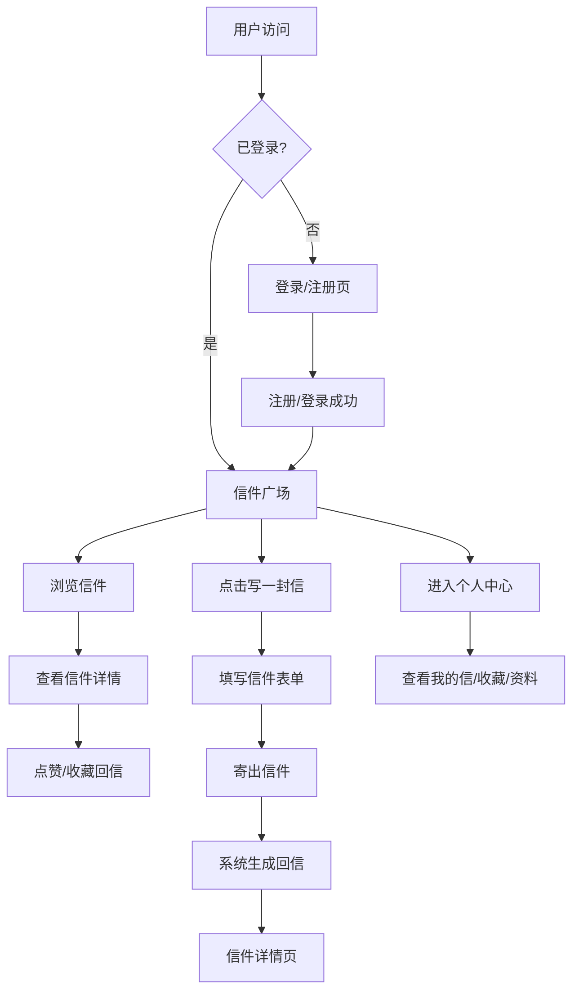

## 1. 产品概述

"星邮局"是一个幻想情感主题的Web应用，用户可以给未来或平行世界的人写信，并收藏来自平行时空的神秘回信。

- **核心目的**：为用户提供一个情感寄托、治愈心灵的奇幻空间，通过"跨越时空的书信"形式抒发内心情感
- **目标用户**：需要情感出口、喜欢幻想题材、乐于分享心情的年轻人
- **产品价值**：打造一个温暖、神秘、富有想象力的情感社区，让每一封信都承载思念与希望

## 2. 核心功能

### 2.1 用户角色

| 角色 | 注册方式 | 核心权限 |
|------|----------|----------|
| 普通用户 | 邮箱/密码注册 | 写信、浏览信件广场、点赞、收藏回信、管理个人中心 |

### 2.2 功能模块

1. **认证模块**：用户注册、登录、退出登录
2. **写信模块**：撰写信件、选择收件人类型（未来/过去/平行世界）、设置情绪标签、选择是否公开
3. **信件广场**：浏览所有公开信件、按情绪标签筛选、按热度/时间排序、搜索关键词、查看信件详情与回信
4. **情绪标签模块**：展示热门情绪标签、点击查看该标签下的所有信件
5. **个人中心**：查看个人资料、我写的信、我收藏的回信、数据统计、编辑资料

### 2.3 页面详情

| 页面名称 | 模块名称 | 功能描述 |
|----------|----------|----------|
| 登录/注册页 | 表单区 | 邮箱密码登录/注册，动效背景 |
| 首页/信件广场 | 顶部导航 | Logo、导航菜单、用户头像 |
| 首页/信件广场 | Hero区 | 星邮局主题标语、引导写信CTA |
| 首页/信件广场 | 情绪标签云 | 展示热门情绪标签，点击筛选 |
| 首页/信件广场 | 信件列表 | 卡片式展示公开信件，支持筛选/排序/搜索 |
| 写信页 | 写信表单 | 收件人、主题、内容、情绪标签选择、公开/匿名设置 |
| 信件详情页 | 信件内容 | 完整信件展示，带书信特效 |
| 信件详情页 | 回信区 | 展示平行世界的回信列表 |
| 信件详情页 | 互动区 | 点赞、收藏、回复功能 |
| 个人中心 | 资料卡片 | 头像、昵称、简介、数据统计 |
| 个人中心 | 标签页切换 | 我写的信 / 我收藏的回信 / 编辑资料 |

## 3. 核心流程

用户注册/登录 → 进入信件广场浏览 → 点击"写一封信" → 填写信件内容、选择情绪标签 → 寄出信件 → 系统随机生成平行世界回信 → 用户可收藏回信 → 在个人中心查看所有信件与收藏

## 4. 用户界面设计

### 4.1 设计风格

- **主色调**：深邃星空紫 (#1a1446) + 柔和极光蓝 (#4cc9f0) + 温暖星光金 (#ffd166)
- **辅助色**：玫瑰粉 (#f72585)、薄荷绿 (#06d6a0)、暮色橙 (#ff7b00)
- **整体风格**：梦幻星空主题，深色调背景配星星/星云动效，书信卡片采用纸张质感
- **按钮风格**：圆角胶囊按钮，渐变填充，悬浮有发光效果
- **字体**：标题使用富有装饰性的衬线字体（Noto Serif SC），正文使用圆润无衬线（Noto Sans SC）
- **布局风格**：卡片式布局，信件采用信纸卷边效果，毛玻璃导航栏
- **图标/emoji**：大量使用星空、书信、星座、治愈系emoji增强幻想氛围

### 4.2 页面设计概述

| 页面名称 | 模块名称 | UI 元素 |
|----------|----------|----------|
| 登录/注册页 | 整体 | 星空渐变背景 + 流星划过动效 + 毛玻璃登录卡片 + 柔和内发光 |
| 首页/信件广场 | Hero区 | 大标题发光效果 + 飘动星尘 + CTA按钮悬浮光晕 |
| 首页/信件广场 | 情绪标签 | 彩色胶囊标签，悬浮放大，带对应emoji |
| 首页/信件广场 | 信件卡片 | 纸张纹理背景 + 卷边阴影 + 邮票装饰 + 淡入上移动画 |
| 写信页 | 表单 | 复古信纸背景 + 羽毛笔图标 + 字数统计 + 标签多选 |
| 信件详情页 | 信件展示 | 大尺寸信纸 + 火漆印章装饰 + 打字机逐字显示效果 |
| 信件详情页 | 回信区 | 不同颜色边框区分不同平行世界 + 世界编号标签 |
| 个人中心 | 资料卡片 | 渐变头像框 + 数据统计数字跳动动画 |

### 4.3 响应式设计

- Desktop-first 设计，在 1440px 宽屏下进行主设计
- 断点：1024px（平板）、768px（手机）、480px（小屏手机）
- 移动端：导航栏折叠为汉堡菜单，卡片单列展示，表单全宽显示
- 触控优化：按钮最小触控区域 44x44px，滑动手势支持

### 4.4 动效与氛围

- **背景**：星星缓慢闪烁、偶尔流星划过、星云渐变色缓慢流动
- **页面过渡**：路由切换带淡入淡出 + 轻微位移
- **卡片交互**：悬浮上移 + 阴影加深 + 星光微光效果
- **信件打开**：信封展开动画 + 信纸滑出效果
- **发送成功**：信件化作光点飞向星空的粒子动画
