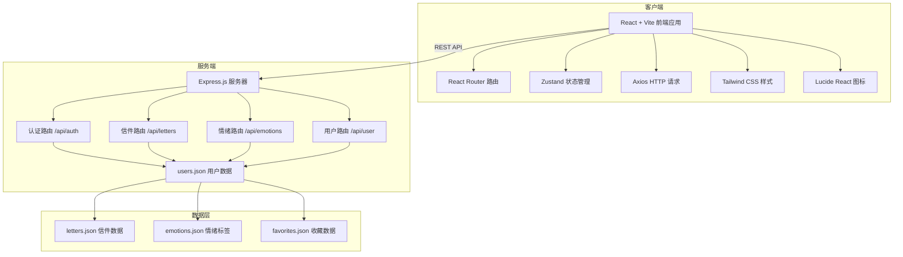
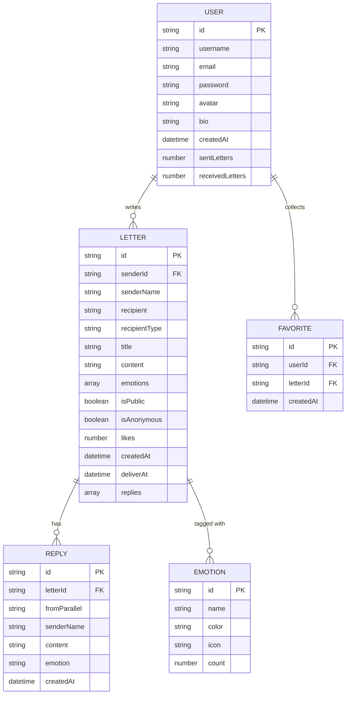

## 1. 架构设计



## 2. 技术栈说明

- **前端框架**：React 18 + TypeScript
- **构建工具**：Vite 5
- **路由管理**：React Router DOM 6
- **状态管理**：Zustand
- **HTTP 客户端**：Axios
- **样式方案**：Tailwind CSS 3
- **图标库**：Lucide React
- **后端框架**：Express 4
- **数据存储**：JSON 文件模拟（Node.js fs 模块操作）
- **ID 生成**：UUID（自定义）
- **跨域处理**：CORS 中间件
- **并发启动**：Concurrently（同时启动前后端）

## 3. 路由定义

| 前端路由 | 页面组件 | 用途 |
|----------|----------|------|
| `/login` | Login | 用户登录页 |
| `/register` | Register | 用户注册页 |
| `/` | Plaza | 信件广场（首页） |
| `/write` | WriteLetter | 写信页面 |
| `/letter/:id` | LetterDetail | 信件详情页 |
| `/emotions` | Emotions | 情绪标签总览 |
| `/emotions/:name` | EmotionLetters | 指定情绪标签下的信件 |
| `/profile` | Profile | 个人中心 |
| `/profile/edit` | EditProfile | 编辑个人资料 |

### 后端 API 路由

| 方法 | 路径 | 用途 |
|------|------|------|
| POST | `/api/auth/register` | 用户注册 |
| POST | `/api/auth/login` | 用户登录 |
| POST | `/api/auth/logout` | 退出登录 |
| GET | `/api/letters` | 获取信件列表（支持筛选/分页/搜索） |
| GET | `/api/letters/:id` | 获取信件详情 |
| POST | `/api/letters` | 创建新信件 |
| POST | `/api/letters/:id/like` | 点赞信件 |
| POST | `/api/letters/:id/reply` | 给信件回信 |
| GET | `/api/emotions` | 获取所有情绪标签 |
| GET | `/api/emotions/trending` | 获取热门情绪标签 |
| GET | `/api/emotions/:name/letters` | 获取指定情绪的信件 |
| GET | `/api/user/:userId` | 获取用户信息 |
| PUT | `/api/user/:userId` | 更新用户信息 |
| GET | `/api/user/:userId/letters` | 获取用户写的信件 |
| GET | `/api/user/:userId/favorites` | 获取用户收藏 |
| POST | `/api/user/:userId/favorites/:letterId` | 收藏信件 |
| DELETE | `/api/user/:userId/favorites/:letterId` | 取消收藏 |
| GET | `/api/user/:userId/stats` | 获取用户统计数据 |

## 4. 核心数据模型

### 4.1 数据模型 ER 图



### 4.2 Zustand Store 状态

```typescript
interface UserState {
  user: User | null;
  token: string | null;
  isAuthenticated: boolean;
  login: (user: User, token: string) => void;
  logout: () => void;
  updateUser: (data: Partial<User>) => void;
}

interface UIState {
  isLoading: boolean;
  toast: ToastMessage | null;
  showToast: (message: ToastMessage) => void;
  hideToast: () => void;
}
```

## 5. 项目目录结构

```
xcf-200/
├── backend/                          # 后端服务
│   ├── data/                         # JSON 数据文件
│   │   ├── users.json
│   │   ├── letters.json
│   │   ├── emotions.json
│   │   └── favorites.json
│   ├── routes/                       # API 路由
│   │   ├── auth.js
│   │   ├── letters.js
│   │   ├── emotions.js
│   │   └── user.js
│   ├── utils/                        # 工具函数
│   │   └── db.js
│   ├── server.js                     # 服务器入口
│   └── package.json
├── frontend/                         # 前端应用
│   ├── public/                       # 静态资源
│   ├── src/
│   │   ├── api/                      # API 请求封装
│   │   │   ├── auth.ts
│   │   │   ├── letters.ts
│   │   │   ├── emotions.ts
│   │   │   └── user.ts
│   │   ├── components/               # 可复用组件
│   │   │   ├── Layout/
│   │   │   │   ├── Navbar.tsx
│   │   │   │   ├── Footer.tsx
│   │   │   │   └── StBackground.tsx
│   │   │   ├── Letter/
│   │   │   │   ├── LetterCard.tsx
│   │   │   │   ├── LetterPaper.tsx
│   │   │   │   └── ReplyCard.tsx
│   │   │   ├── Emotion/
│   │   │   │   ├── EmotionTag.tsx
│   │   │   │   └── EmotionCloud.tsx
│   │   │   └── UI/
│   │   │       ├── Button.tsx
│   │   │       ├── Input.tsx
│   │   │       ├── Modal.tsx
│   │   │       ├── Toast.tsx
│   │   │       └── Pagination.tsx
│   │   ├── hooks/                    # 自定义 Hooks
│   │   │   ├── useAuth.ts
│   │   │   └── useLetters.ts
│   │   ├── pages/                    # 页面组件
│   │   │   ├── Login.tsx
│   │   │   ├── Register.tsx
│   │   │   ├── Plaza.tsx
│   │   │   ├── WriteLetter.tsx
│   │   │   ├── LetterDetail.tsx
│   │   │   ├── Emotions.tsx
│   │   │   ├── Profile.tsx
│   │   │   └── NotFound.tsx
│   │   ├── store/                    # Zustand 状态管理
│   │   │   ├── useAuthStore.ts
│   │   │   └── useUIStore.ts
│   │   ├── types/                    # TypeScript 类型定义
│   │   │   └── index.ts
│   │   ├── utils/                    # 工具函数
│   │   │   ├── api.ts
│   │   │   └── helpers.ts
│   │   ├── App.tsx
│   │   ├── main.tsx
│   │   └── index.css                 # 全局样式 + Tailwind
│   ├── index.html
│   ├── vite.config.ts
│   ├── tailwind.config.js
│   ├── postcss.config.js
│   ├── tsconfig.json
│   └── package.json
├── package.json                      # 根目录并发启动配置
└── .trae/
    └── documents/
        ├── 星邮局-PRD.md
        └── 星邮局-技术架构.md
```

## 6. 前端关键配置

### Vite 配置要点
- 代理 `/api` 到 `http://localhost:3001`
- 路径别名 `@` → `src`

### Tailwind 主题扩展
- 自定义星空配色方案（indigo-950, cosmic-blue, star-gold 等）
- 自定义动画：`twinkle`, `float`, `shooting-star`, `fade-in-up`
- 自定义字体：`font-serif-sc`, `font-sans-sc`
- 自定义背景：星空渐变、纸张纹理

### 初始数据
后端 `letters.json` 预置 6 封示例信件，涵盖不同情绪标签、收件人类型，并带平行世界的回信，方便直接预览效果。
